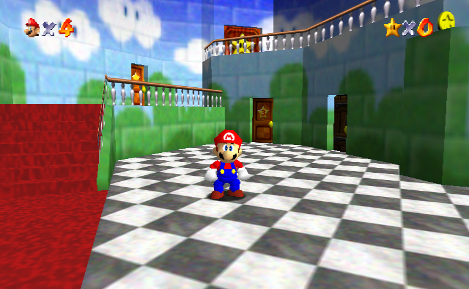
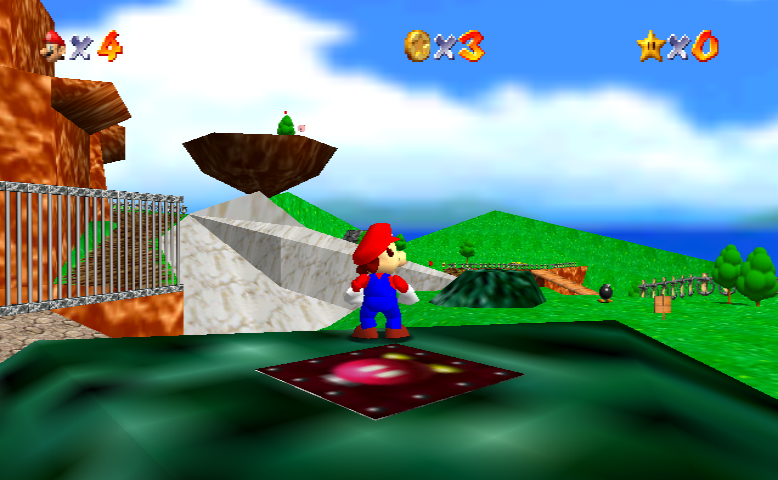
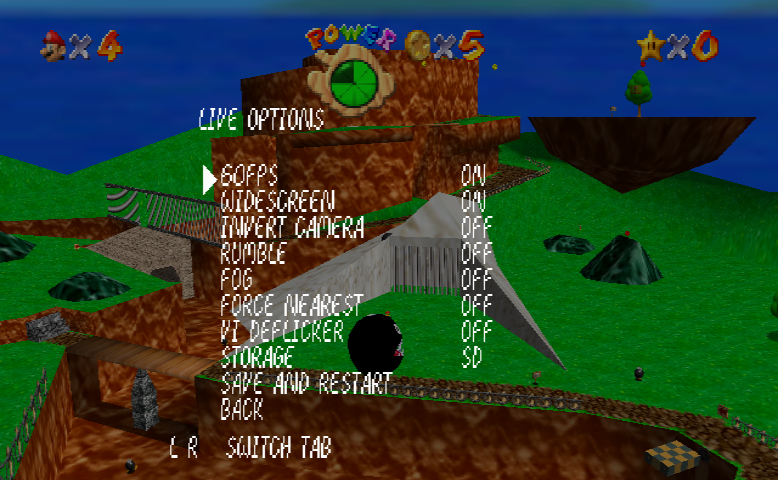

# Super Mario 64 Wii/Gamecube Port

This is a native port of Super Mario 64 to the Nintendo Gamecube/Nintendo Wii.




This repo does **not** include all assets necessary for compiling the game.
A prior copy of the game is required to extract the assets.
Do not ask for where to obtain a ROM. That's for you to figure out.

With the port to more advanced hardware, there also is a handful of option enhancements that can be enabled in-game.
Do note that some enhancements may result in slightly buggy or odd behaviour that wouldn't be noticed otherwise, but nothing game-breaking.
Enhancements can be accessed by pausing then pressing the Z/L equivalent for your controller.

You can expect full-speed on Wii with all the performance enhancements enabled at all times.
I didn't test enough on Gamecube to make the same claim, but it should be able to handle at least 60fps without issue.



## Enhancements Menu Options
| Enhancement    | Options                 | Description                                                                                                                                                                                                             |
|----------------|-------------------------|-------------------------------------------------------------------------------------------------------------------------------------------------------------------------------------------------------------------------|
| 60FPS          | On/Off                  | Enable interpolated 60FPS mode.                                                                                                                                                                                         |
| WIDESCREEN     | On/Off/Auto/Pillarboxed | Enable/Disable widescreen. Auto goes based on Wii's system settings. Pillarboxing is for 4:3 on 16:9 displays to not get stretching.                                                                                    |
| 240P           | On/Off                  | Output at 240p over 480i/p [Requires restart to apply].                                                                                                                                                                 |
| ANTIALIAS      | On/Off                  | Enable/Disable antialiasing [Only applies when 240p is on and requires restart to apply].                                                                                                                               |
| INVERT CAMERA  | On/Off                  | Flip the camera movement caused by right and left c-buttons [Set to off if using Puppycam].                                                                                                                             |
| RUMBLE         | On/Off                  | Enable/Disable the Shindou version's rumble on any region.                                                                                                                                                              |
| FOG            | On/Off                  | Enable/Disable drawing fog in the distance. Also increases draw-distance for some objects.                                                                                                                              |
| FORCE NEAREST  | On/Off                  | Force nearest-neighbour over bilinear filtering for textures. Looks awful, do not use.                                                                                                                                  |
| VI DEFLICKER   | On/Off                  | Enable/Disable the Wii's deflicker filter. Enable this on non-CRTs for a cleaner image.                                                                                                                                 |
| PUPPYCAM       | On/Off                  | Enable/Disable Puppycam (See here on more information on what this is: https://github.com/FazanaJ/puppycam. This also makes the camera fully analogue, bypassing the c-buttons entirely except on Wii remote + Nunchuk. |
| SENSITIVITY X  | Number                  | Higher makes the camera more sensitive and thus faster in the X axis.                                                                                                                                                   |
| SENSITIVITY Y  | Number                  | Higher makes the camera more sensitive and thus faster in the Y axis.                                                                                                                                                   |
| INVERT X       | On/Off                  | Invert the left and right camera inputs.                                                                                                                                                                                |
| INVERT Y       | On/Off                  | Invert the up and down camera inputs.                                                                                                                                                                                   |
| STOPPING SPEED | Number                  | Controls how quickly the camera decelerates after the button/stick isn't being held. Higher means longer deceleration time.                                                                                             |
| CENTERING      | Number                  | How aggressively should the camera try to centre behind Mario. Higher is more aggressive.                                                                                                                               |
| PANNING        | Number                  | How far should the camera pan when the stick is pressed. Higher means more panning.                                                                                                                                     |
 
Everything is saved automatically upon changing the value. There's no need to save and restart unless you toggle 240p or Antialiasing.

## Known Issues

- Peach painting doesn't fade into Bowser
- Credits have clipping issues
- Docker build may be broken.

## Controls

| N64 control   | Wii Remote + Nunchuk   | Classic Controller | GameCube Controller          |
|---------------|------------------------|--------------------|------------------------------|
| Control stick | Nunchuk stick          | Left stick         | Control stick                |
| A             | A                      | A                  | A                            |
| B             | B or 2                 | B                  | B                            |
| Start         | + or -                 | + or -             | Start                        |
| Z             | Nunchuk Z or 1         | L                  | Z                            |
| L             | Not mapped             | Not mapped         | L                            |
| R             | Nunchuk C              | R                  | R                            |
| C-Up          | Wii Remote D-Pad Up    | Right stick up     | D-Pad Up or C-Stick Up       |
| C-Down        | Wii Remote D-Pad Down  | Right stick down   | D-Pad Down or C-Stick Down   |
| C-Left        | Wii Remote D-Pad Left  | Right stick left   | D-Pad Left or C-Stick Left   |
| C-Right       | Wii Remote D-Pad Right | Right stick right  | D-Pad Right or C-Stick Right |
| D-Pad         | Not mapped             | Not mapped         | Not mapped                   |

## Building

Successful compilation will result in a `boot.dol` being created in `build/VERSION_GX/boot.dol` where `VERSION` is one of `us`, `eu`, `jp` or `sh`, and `GX` is either `wii` or `cube`.

For Wii, place the `boot.dol`, `meta.xml`, and `icon.png` from the above `build/VERSION_GX/boot.dol` in a directory called `/apps/sm64` on your SD card and run using the [Homebrew Channel](https://wiibrew.org/wiki/Homebrew_Channel).
For Gamecube, copy the `boot.dol` to your SD card and run using Swiss or your preferred Gamecube homebrew launcher.

**Supported Build Methods:**

- [Docker](#docker) // May currently be broken
- [Linux / WSL (Ubuntu >= 18.04)](#linux--wsl-ubuntu)
- [Windows (MSYS2)](#windows-msys2)

### Docker
The following assumes a basic understanding of [Docker](https://www.docker.com/); if you do not belong to the `docker` group, prefix those commands with `sudo`.

**Install Docker:**
Follow the instructions here: [Docker Install](https://docs.docker.com/engine/install/ubuntu/) to get docker installed

**Clone Repository:**
```sh
git clone https://github.com/mkst/sm64-port.git --branch wii

cd sm64-port
```

**Copy in baserom.XX.z64:**
```sh
cp /path/to/your/baserom.us.z64 ./ # change 'us' to 'eu', 'jp' or 'sh' as appropriate
```

**Build with pre-baked image:**
Change `VERSION=us` if applicable.
```sh
docker run --rm -v $(pwd):/sm64 markstreet/sm64:wii make VERSION=us --jobs 4 # Linux/macOS
docker run -rm -v C:\path\to\sm64-port:/sm64 markstreet/sm64:wii make Version=us --jobs 4 # Windows. Replace /path/to with your actual path.
```

### Linux / WSL (Ubuntu)

These exact instructions work on **Ubuntu >= 18.04**\
This can be done on any Linux distro, just substitute the packages and DevkitPro section for your distro's equivalent.

```sh
sudo apt-get update && \
    sudo apt-get install -y \
        binutils-mips-linux-gnu \
        bsdmainutils \
        build-essential \
        libaudiofile-dev \
        pkg-config \
        python3 \
        wget \
        zlib1g-dev
````
Follow **Debian and derivatives** section of the DevkitPro install instructions over at [DevkitPro](https://devkitpro.org/wiki/devkitPro_pacman)

```shell
sudo dkp-pacman -Syu wii-dev gamecube-dev --noconfirm

cd

git clone https://github.com/mkst/sm64-port.git --branch wii

cd sm64-port

# Go and copy the baserom to C:\temp (create the directory in Windows Explorer)
# If you are running Linux natively, just copy the baserom.us.z64 file to the current directory. No need to create anything.
cp /mnt/c/temp/baserom.us.z64 ./

sudo chmod 644 ./baserom.us.z64

export PATH="/opt/devkitpro/tools/bin/:~/sm64-port/tools:${PATH}"
export DEVKITPRO=/opt/devkitpro
export DEVKITPPC=/opt/devkitpro/devkitPPC

make -j$(nproc) 
```
If the ```make -j$(nproc)``` command fails, try the Docker build in the same directory you are already in. If the Docker build then fails, run:

```shell
sudo -i
make -j$(nproc)
```
This is super hacky, but should get you a working executable. If you ever wish to rebuild you should only need to rerun the make command.

### Windows (MSYS2)

WSL is the preferred route, but you can also use MSYS2 (MINGW64) to compile.

For each instruction copy and paste the contents into the **MINGW64** console.

**Get MSYS2:**

Navigate to https://www.msys2.org/ and download the installer.

**Install and Run MINGW64:**

```
Next, Next, Next, Finish (keep the box checked to "Run MSYS 64bit now").
```

**Add keyserver for package validation:**

```sh
pacman-key --recv BC26F752D25B92CE272E0F44F7FD5492264BB9D0 --keyserver keyserver.ubuntu.com
pacman-key --lsign BC26F752D25B92CE272E0F44F7FD5492264BB9D0
```

**Add DevKitPro keyring:**

```sh
pacman -U --noconfirm https://downloads.devkitpro.org/devkitpro-keyring.pkg.tar.xz
```

**Add DevKitPro package repositories:**

```sh
cat <<EOF >> /etc/pacman.conf
[dkp-libs]
Server = https://downloads.devkitpro.org/packages
[dkp-windows]
Server = https://downloads.devkitpro.org/packages/windows
EOF
```

**Update dependencies:**

```sh
pacman -Syu --noconfirm
```

MINGW64 may close itself when done, if it does, find `MSYS2 MinGW 64bit` in your Start Menu and open again.

**Install Dependencies:**

```sh
pacman -S wii-dev git make python3 mingw-w64-x86_64-gcc --noconfirm
```

**Setup Environment Variables:**

```sh
export PATH=$PATH:/opt/devkitpro/tools/bin && echo "OK!"
export DEVKITPRO=/opt/devkitpro && echo "OK!"
export DEVKITPPC=/opt/devkitpro/devkitPPC && echo "OK!"
```

**Clone Repository:**

```sh
git clone https://github.com/mkst/sm64-port.git --branch wii
```

**Navigate into freshly checked out repo:**

```sh
cd sm64-port && echo "OK!"
```

**Copy in baserom.XX.z64:**

This assumes that you have create the directory `c:\temp` via Windows Explorer and copied the Super Mario 64 `baserom.XX.z64` to it.
```sh
cp /c/temp/baserom.us.z64 ./ && echo "OK!" # change 'us' to 'eu', 'jp' or 'sh' as appropriate
```

**Compile:**

```sh
make VERSION=us -j$(nproc)  # change 'us' to 'eu', 'jp' or 'sh' as appropriate
```

## Project Structure

    sm64
    ├── actors: object behaviors, geo layout, and display lists
    ├── asm: handwritten assembly code, rom header
    │   └── non_matchings: asm for non-matching sections
    ├── assets: animation and demo data
    │   ├── anims: animation data
    │   └── demos: demo data
    ├── bin: C files for ordering display lists and textures
    ├── build: output directory
    ├── data: behavior scripts, misc. data
    ├── doxygen: documentation infrastructure
    ├── enhancements: example source modifications
    ├── include: header files
    ├── levels: level scripts, geo layout, and display lists
    ├── lib: SDK library code
    ├── rsp: audio and Fast3D RSP assembly code
    ├── sound: sequences, sound samples, and sound banks
    ├── src: C source code for game
    │   ├── audio: audio code
    │   ├── buffers: stacks, heaps, and task buffers
    │   ├── engine: script processing engines and utils
    │   ├── game: behaviors and rest of game source
    │   ├── goddard: Mario intro screen
    │   ├── menu: title screen and file, act, and debug level selection menus
    │   └── pc: port code, audio and video renderer
    ├── text: dialog, level names, act names
    ├── textures: skybox and generic texture data
    └── tools: build tools

## Contributing
Pull requests are welcome. For major changes, please open an issue first to discuss what you would like to change.
